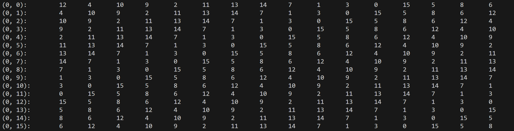
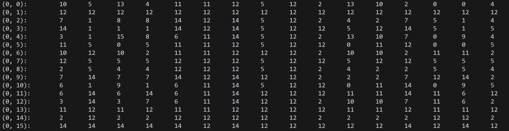
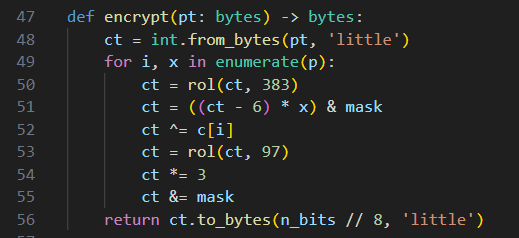

# rev/tables

The main "gimmick" of this challenge is that basic operations (e.g. add, subtract, xor, bitwise or) are implemented using lookup-tables; however, the output of the operation has been encrypted with a random SBox that is unique to each lookup-table.

When the outputs of these encrypted lookup-tables are used as inputs in later lookup-tables, the lookup-tables shuffle their elements in order to account for their inputs being encrypted by an SBox.

Note that input values are considered as "unencrypted".

For example, this is a lookup-table for a 4-bit addition with unencrypted inputs:

This is a lookup-table for a 4-bit bitwise or with encrypted inputs (notice the rows/columns have been shuffled):

Once you figure out the gimmick of this challenge, it is possible to write a disassembler for this binary. See the example in `disasm.py`.

Part 1, disassembled, is quite simple. See the disassembly in `part_1.txt`.

Part 2 is larger and more complex, but the code essentially just implements the following algorithm (see `cipher/encrypt.py`). `p` and `c` are randomly generated 432-bit integers.

All integers in here are 432-bit, so you can imagine this whole `encrypt` method as a process being done modulo `2**432`. However, the values of `x` used for multiplication on line 51 are not necessarily coprime with the modulus of `2**432`. Thus, there are multiple valid inputs to this `encrypt` method that would produce the same output.

Luckily though, you can use the known 8 bytes from part 1 to bruteforce which of these inputs is the correct one to get the flag. See `decrypt.py` for an example implementation of this bruteforce.

`.;,;.{mayb3_i_us3d_a_b1t_t0o_m4ny_lookup_t4bl3s_5ee159e93528}`
